<div align="center">

# Albert’s Imagebook — 24 种 Codex 照片转插画风格

### 把拍下的瞬间，变成想留下来的小作品。

**开源 Codex 图片 Skill，24 种风格，一条指令。**

[English](README.md) · [可以做什么](#alberts-imagebook-可以做什么) ·
[24 种风格](#style-book) · [开始使用](#开始使用) · [添加风格](CONTRIBUTING.md)

</div>

Albert’s Imagebook 是一个**把照片变成艺术作品的开源 Codex Skill**。只需安装一个
`$albert-imagebook`，就能把人物、旅行和日常照片转换成 24 种可复用的插画风格，包括贴纸、
剪纸、版画、拼贴、像素画和绘画小作品；也能导出适合社交平台的精确尺寸图片及原图对照图。

| 你提供的照片 | 蜡笔小记会这样记下它 |
| --- | --- |
|  | [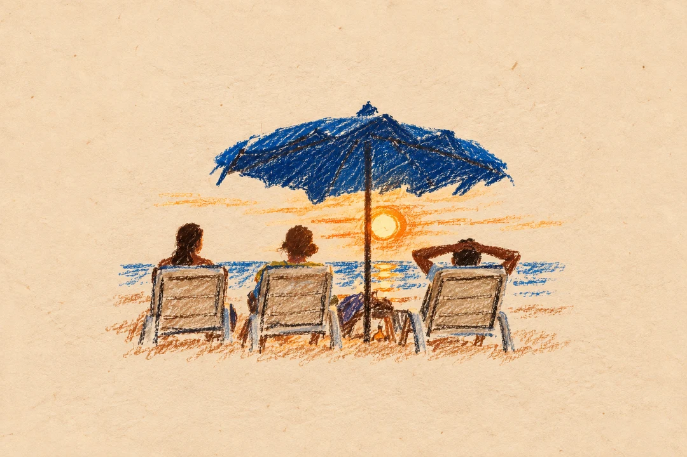](styles/crayon-memory-postcard/README.zh-CN.md) |

保留一起看日落的动作和关系，把复杂环境交给几笔颜色与露出的纸底。
想要更安静的小画，可以选「轻线丙烯」；喜欢可见的颜料厚度，可以选「颜料小岛」。

## Albert's Imagebook 可以做什么？

它是一套面向 Codex 的照片转艺术工作流，不是一次性 Prompt 合集。上传照片后，说出风格名称
或让它推荐，剩下的画法、构图、输出尺寸和对照排版都由同一个 Skill 处理。

| 搜索或创作需求 | Skill 能做什么 |
| --- | --- |
| 照片转插画 | 蜡笔、丙烯、水彩、厚涂、漫画和编辑绘画 |
| 照片转贴纸 | 珐琅、涂鸦、蓝线轮廓和日常贴纸组合 |
| 旅行照片艺术化 | 印章、剪纸、孔版印刷、蓝晒和纪念品式构图 |
| 照片转像素画 | 保留原图故事关系的清晰像素小场景 |
| 社交媒体图片导出 | 精确输出 3:4、4:5、1:1、9:16 和 16:9 PNG |
| 原图与作品对照 | 上下或左右严格各占 50% 的对照图 |

## 为什么合到一本 Imagebook？

旧版 [Image Skillbook](https://github.com/AlbertAZ1992/image-skillbook) 把 7 种风格做成了
7 个可以独立安装的 Skills。这样便于逐个验证，却也让同一套创作体验变成了 7 个需要分别发现、
安装和调用的产品。

Albert's Imagebook 把共用流程和 24 种风格收进一个 `$albert-imagebook`。安装一次，直接说出
想要的风格，之后换风格也不用记新指令。新增画法只需要加入同一本风格书，不再增加新的 SKU。
后续风格会在这里继续更新；旧版独立 Skills 仍保留给已有用户使用。

<a id="style-book"></a>

## 24 种图片风格

同一张照片，可以变成蜡笔、丙烯、厚涂、贴纸、剪纸、刺绣、版画、漫画或像素世界。
下面 24 种都已经放进同一个 Skill；点击名称或图片查看完整样张和调用提示。

| [蜡笔小记](styles/crayon-memory-postcard/README.zh-CN.md) | [轻线丙烯](styles/editorial-painted-memory/README.zh-CN.md) | [珐琅拾光](styles/enamel-travel-keepsake/README.zh-CN.md) |
| --- | --- | --- |
| [](styles/crayon-memory-postcard/README.zh-CN.md) | [](styles/editorial-painted-memory/README.zh-CN.md) | [](styles/enamel-travel-keepsake/README.zh-CN.md) |
| [颜料小岛](styles/impasto-miniature-world/README.zh-CN.md) | [笔触叙事](styles/painted-editorial-reconstruction/README.zh-CN.md) | [照片奇遇](styles/photo-doodle-story/README.zh-CN.md) |
| [](styles/impasto-miniature-world/README.zh-CN.md) | [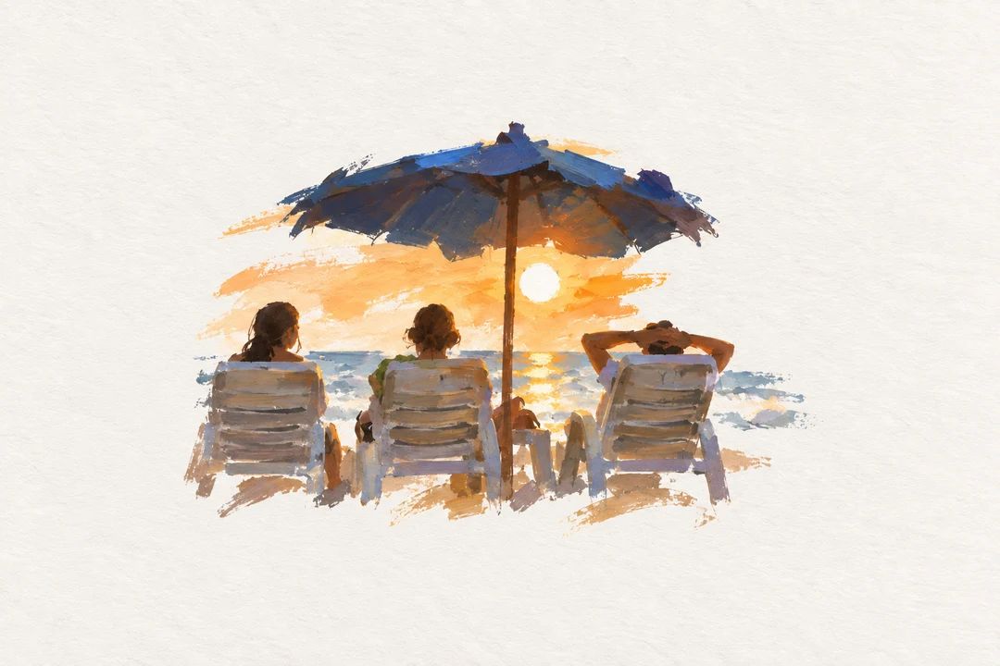](styles/painted-editorial-reconstruction/README.zh-CN.md) | [](styles/photo-doodle-story/README.zh-CN.md) |
| [旅途印记](styles/rubber-stamp-travel-journal/README.zh-CN.md) | [日常贴贴](docs/explorations.md#little-day-stickers) | [粉彩微风](docs/explorations.md#pastel-reverie) |
| [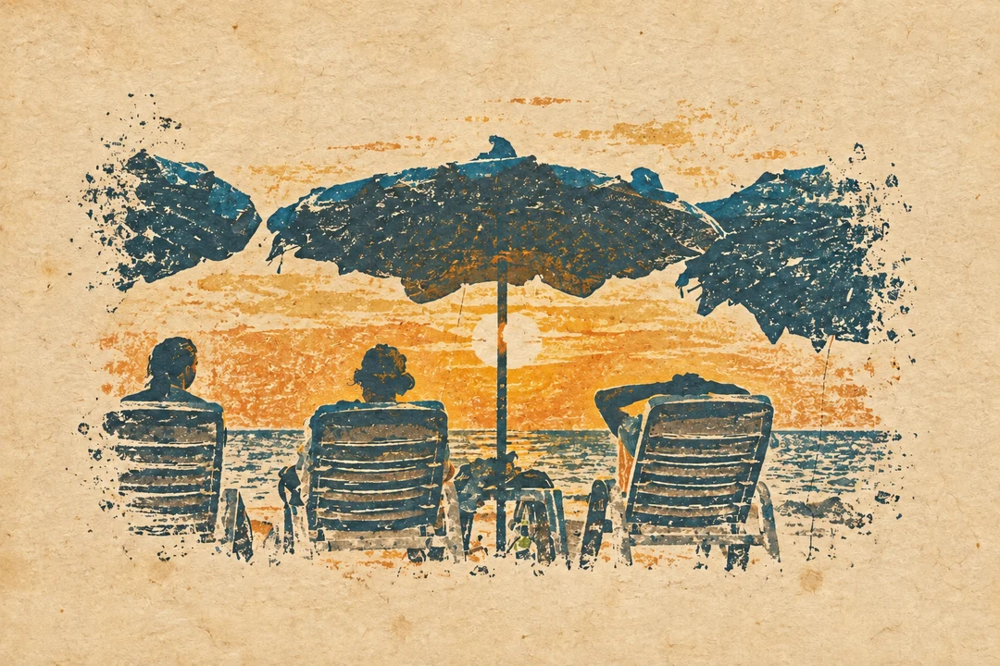](styles/rubber-stamp-travel-journal/README.zh-CN.md) | [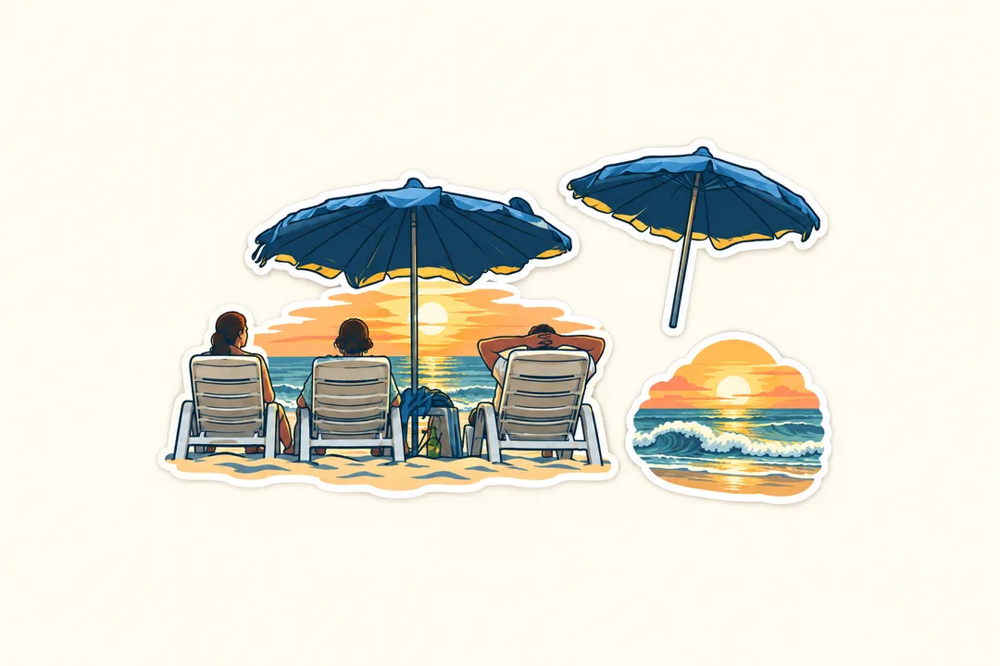](docs/explorations.md#little-day-stickers) | [](docs/explorations.md#pastel-reverie) |
| [细线织忆](docs/explorations.md#threaded-memory) | [水彩晴光](docs/explorations.md#watercolor-light) | [叠纸诗篇](docs/explorations.md#paper-poetry) |
| [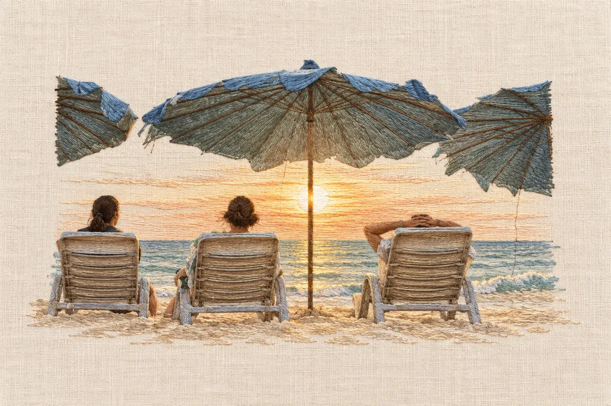](docs/explorations.md#threaded-memory) | [](docs/explorations.md#watercolor-light) | [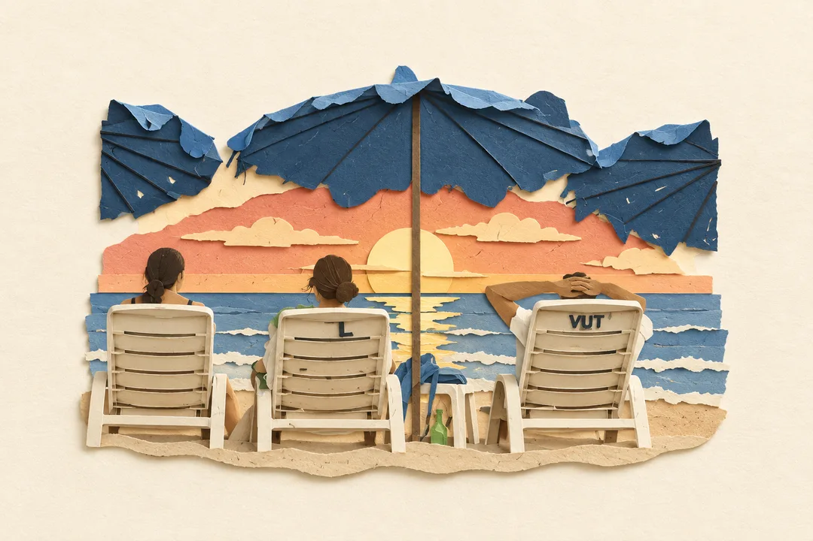](docs/explorations.md#paper-poetry) |
| [孔版周末](docs/explorations.md#riso-weekend) | [蓝晒时光](docs/explorations.md#blue-hour-print) | [几笔之间](docs/explorations.md#a-few-lines) |
| [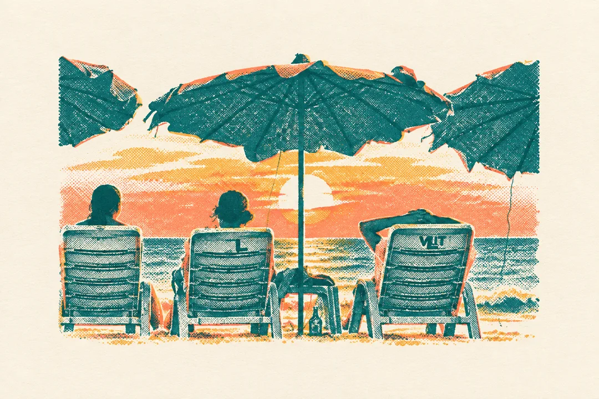](docs/explorations.md#riso-weekend) | [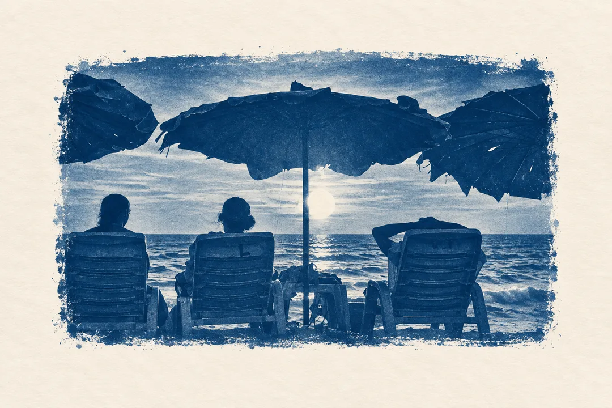](docs/explorations.md#blue-hour-print) | [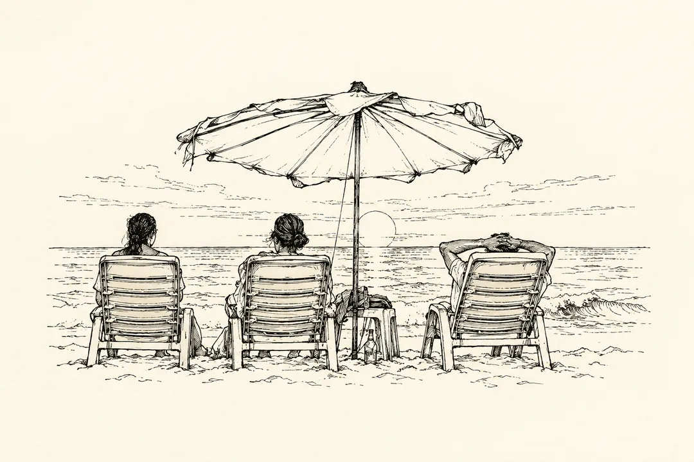](docs/explorations.md#a-few-lines) |
| [周末剪贴](docs/explorations.md#weekend-cutouts) | [字里有海](docs/explorations.md#summer-wordscape) | [清爽漫画](docs/explorations.md#clean-comic) |
| [](docs/explorations.md#weekend-cutouts) | [](docs/explorations.md#summer-wordscape) | [](docs/explorations.md#clean-comic) |
| [复古海报](docs/explorations.md#retro-flat) | [夏日套色](docs/explorations.md#grain-print) | [几何卡纸](docs/explorations.md#geometric-card) |
| [](docs/explorations.md#retro-flat) | [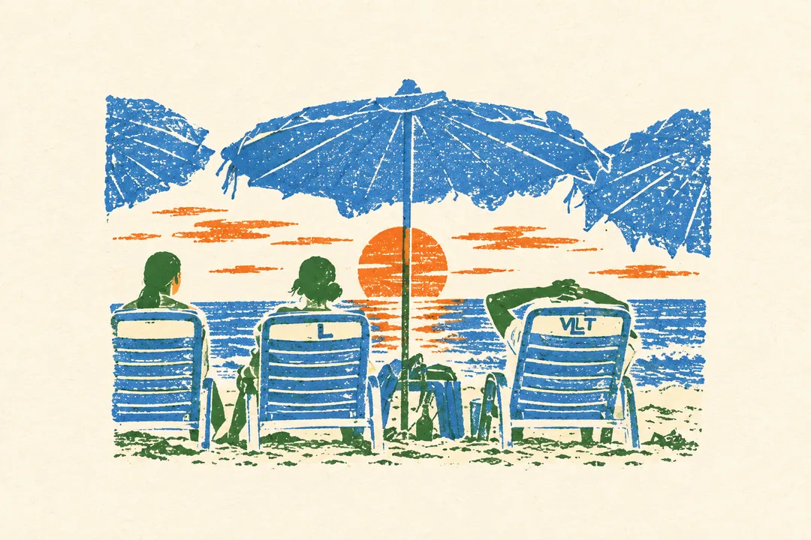](docs/explorations.md#grain-print) | [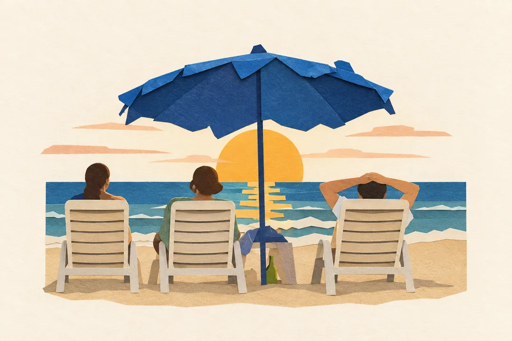](docs/explorations.md#geometric-card) |
| [像素假日](docs/explorations.md#pixel-coast) | [一扇海风](docs/explorations.md#arched-memory) | [蓝线贴纸](docs/explorations.md#navy-outline) |
| [](docs/explorations.md#pixel-coast) | [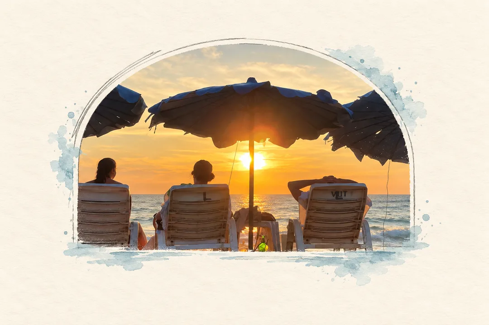](docs/explorations.md#arched-memory) | [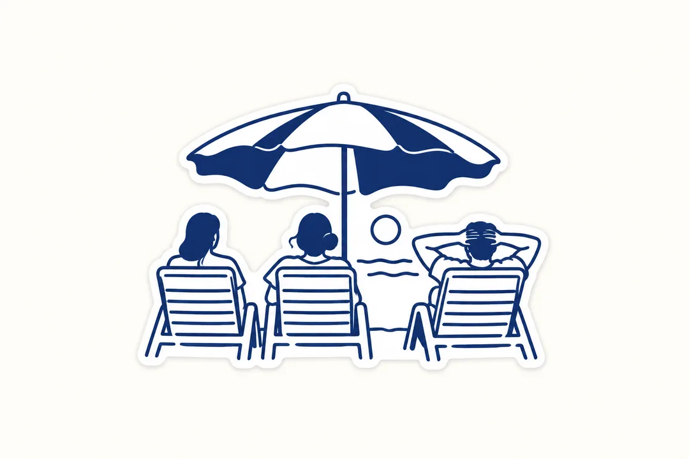](docs/explorations.md#navy-outline) |

部分新风格目前先用海滩照片展示，后续会继续补充人物、城市和日常题材；但 24 种都已经拥有
独立提示词，并由 `$albert-imagebook` 统一发现和调用。

```text
用 $albert-imagebook，把这张照片做成「一扇海风」，不加字。
```

## 开始使用

```bash
npx --yes skills@1.5.24 add AlbertAZ1992/albert-imagebook \
  --skill albert-imagebook --global --agent codex --yes
```

这会把整个风格库安装到 Codex。新开会话，上传照片，然后说：

```text
用 $albert-imagebook，把这张照片做成「颜料小岛」，不加字。
```

默认得到 **1080×1440 的无字竖版作品**：保留照片里的故事，让笔触和露出的纸底一起构图。
你也可以说：

```text
换成「蜡笔小记」，其他设置一样。
做成上下对照图，原图在上、作品在下，各占一半。
做一张 1920×1080 的左右对照图，原图在左。
做成方形，写上「把今天收好」。
把这个目录里的照片都做成「旅途印记」，每张单独保存。
```

<details>
<summary>从本地项目安装</summary>

下载本仓库，在项目目录打开终端，运行：

```bash
npx --yes skills@1.5.24 add . --skill albert-imagebook --global --agent codex --yes
```

</details>

不知道选什么时，直接问“这张照片适合哪两种风格？”

需要支持 Skill 的 Agent 和图片生成/编辑能力。当前本地安装入口面向 Codex；
生图使用宿主可用的图片工具。精确尺寸导出与拼接需要 **Node 22+、ImageMagick 7**。
Skill 本身不提供图片模型或模型额度。

## 一张作品，也是一张可以分享的图

| 画幅 | 成品尺寸 | 适合用途 |
| --- | --- | --- |
| 竖版 · 3:4（默认） | 1080×1440 | 图片笔记、竖版作品 |
| 信息流 · 4:5 | 1080×1350 | 竖版帖子 |
| 方形 · 1:1 | 1080×1080 | 方形帖子、轮播图 |
| 全屏竖版 · 9:16 | 1080×1920 | Story、竖屏封面、手机壁纸 |
| 横版 · 16:9 | 1920×1080 | 横版分享、左右对照 |

可选 **纯作品、上下各半、左右各半**。尺寸指最终成品；原照片直接拼入合成图，
作品另行生成，两个文件都会保存。这些是常用分享画幅，也可以指定其他尺寸。

**留白长在画里。** 主体、纸底和笔触边缘一起生成：涂抹、断笔、露纸或自然淡出由风格决定。
内容以作品区域的 65% 为上限，通常更疏朗；轻线丙烯等风格会留下更多纸面。留白也穿过主体之间，
让重点先被看见，不靠四周加框。导出保留完整画面；
对照图的原照片默认铺满自己的半幅，不额外加白条。

<details>
<summary>更多交付选项：原图摆放、文字、批量和壁纸</summary>

- **原照片**：默认按原比例铺满半幅，裁掉多余部分，并调整裁切位置保留重要主体。
  如果更重视原图完整，可以明确要求“完整原图，允许补边”。
- **作品**：按实际所在区域的比例独立生成。不同画幅分别构图，不拉伸或裁掉作品。
- **文字**：默认不加字；可以给准确文案，也可以让风格提示词用指定语言配字。
- **批量**：可以指定多张照片、多种风格或尺寸；每张原图独立处理。
- **壁纸**：指定设备与尺寸，可以做连贯系列，也可以各自创作。
- **保存**：默认在当前工作目录的 `output/albert-imagebook/`，也可以指定目的目录。

</details>

## 常见问题

### Albert's Imagebook 是一个 Codex Skill，还是 Prompt 合集？

它是一个包含 24 种可复用画法和共用图片工作流的 Codex Skill。只需调用一次
`$albert-imagebook`，之后直接用名称选择或切换风格。

### 不知道选哪种风格怎么办？

日常记忆试试蜡笔小记，简洁人物关系选轻线丙烯，喜欢厚重颜料选颜料小岛。
想保留真实的摄影主体，可以选照片奇遇。也可以让 Agent 根据你的照片推荐。

### 为什么再次生成和案例不同？

案例展示实际输出，不是固定模板。人物、构图与细节会随原图和生成变化。

### 65% 的构图上限是什么意思？

它限制作品区域内整组景物的范围，包括组内空隙；默认视觉居中，通常以 45%～55%
或更少内容构图。原图半幅照常铺满。

### 它使用哪一个图片模型？

Skill 会调用宿主提供的图片生成或编辑工具。当前文档和验证环境面向 Codex；
Skill 本身不包含图片模型，也不提供模型额度。

### 可以用在其他 Agent 中吗？

本仓库提供标准 SKILL.md，当前安装示例和验证环境是 Codex。
其他宿主需要支持 Skill、参考图生图，以及本地导出命令。

## 添加一种新风格

用一份提示词描述画法，再用实际案例展示效果。
[贡献指南](CONTRIBUTING.md)包含文件结构、构图要求与检查命令。

[MIT License](LICENSE) · [素材与灵感来源](docs/sources.md) ·
[Skill 执行说明](SKILL.md) · [AI 可读摘要](llms.txt)
