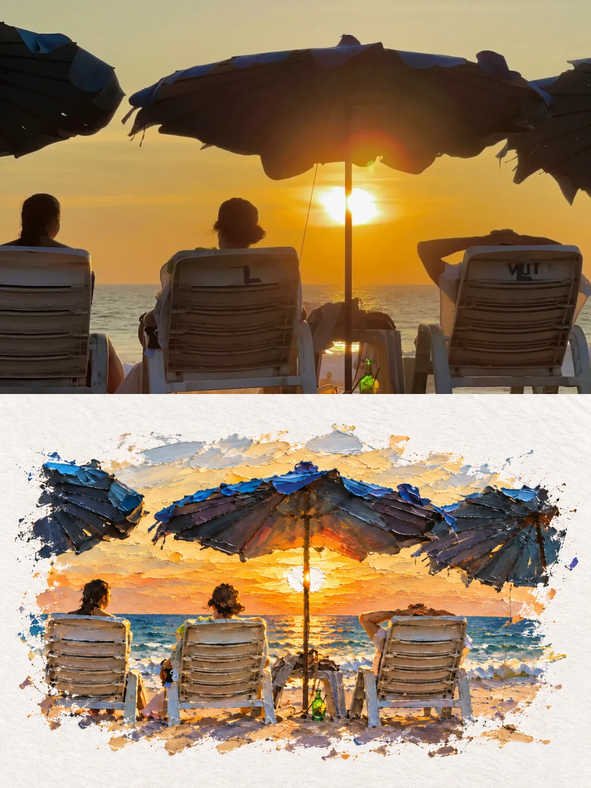
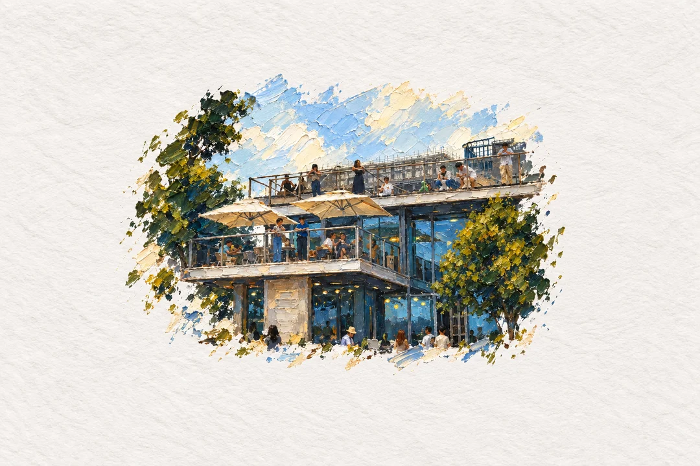
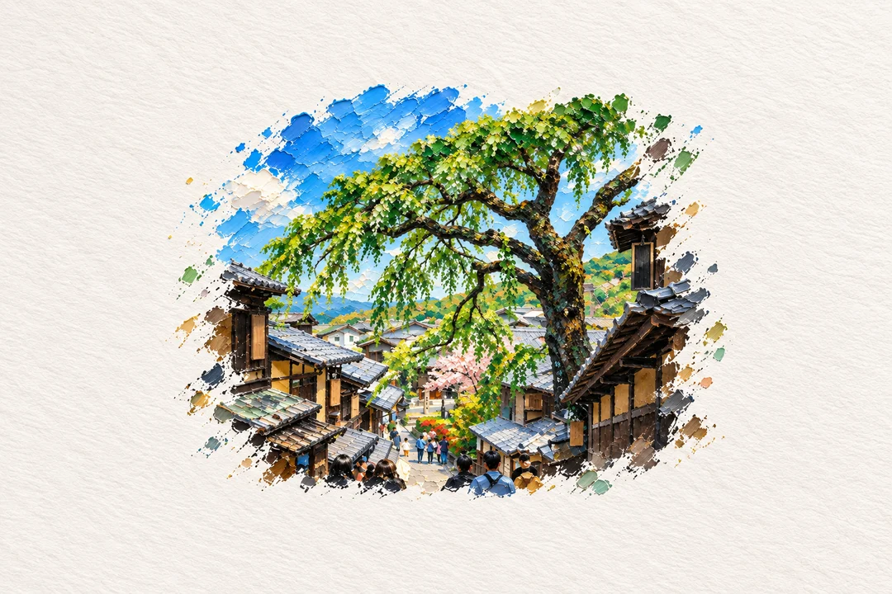

# Impasto Island · Photo to Impasto Painting

[← Albert’s Imagebook](../../README.md) · [简体中文](README.zh-CN.md) · [Full prompt](prompt.md)

**Thick pigment · palette-knife relief · paper island**

Sculpt a scene into a small island of thick paint, with ridges that catch the light.


## The signature

Physical relief, knife marks and cast shadows give sky, trees and water a sculpted texture.

**Best for:** Seaside scenes, trees, layered landscapes.

## Try your own photo

Install [Albert’s Imagebook](../../README.md#get-started), start a new session, and attach a photo:

```text
Use $albert-imagebook. Turn this photo into Impasto Island, no text.
```

The default is a 1080×1440 portrait artwork. To reproduce this page's comparison layout, ask:

```text
Use Impasto Island, top-bottom, original above artwork, 50:50, 1080×1440, no text.
```

## Original → artwork



[Original photo](../../assets/examples/source-beach-sunset.webp) · [Standalone artwork](assets/beach-artwork.webp)

The comparison is 1080×1440, exactly half each; the standalone artwork is 1080×720. The original
fills its half with a west-anchored crop that keeps all three people. Paper, marks and broken
edges are generated together and preserved on export, with no added mat or separator bars.
No new text is added.

## More photos, complete workflow

The café and street examples use the full style prompt and shared delivery rules, including
the 65% ceiling on the artwork's overall scene footprint. Click an artwork for its
1080×1440 original-above-art comparison.

| Coffee terrace | Tree-lined street |
| --- | --- |
| [](assets/coffee-terrace-65-comparison.webp) | [](assets/tree-street-65-comparison.webp) |

[Café source photo](../../assets/examples/source-coffee-terrace.webp) · [Street source photo](../../assets/examples/source-tree-street.webp)

Photos fill their half with a centered crop; the portrait street photo loses its top and bottom
in the wider panel. Artworks keep their complete paper and natural edges. These are actual
generations, so reruns will vary. The footprint ceiling is visual guidance, not a pixel guarantee.

Use the English name **Impasto Island**, Chinese name **颜料小岛**, or stable ID `impasto-miniature-world`.

[Read the complete prompt](prompt.md) · [Explore more styles](../../README.md#the-style-book)
