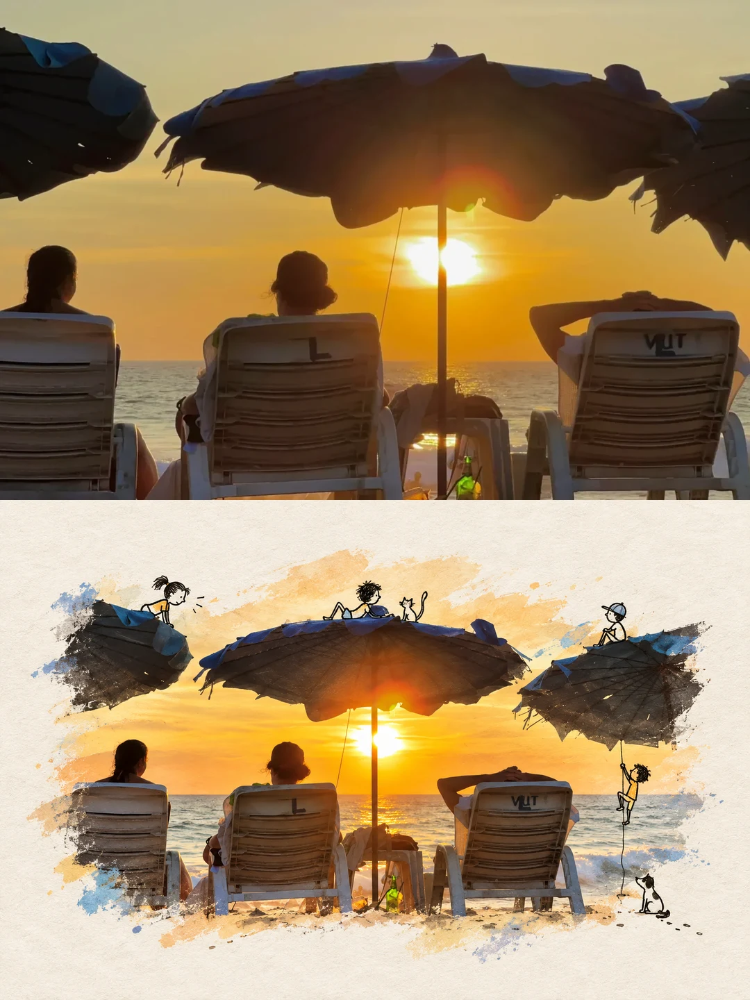
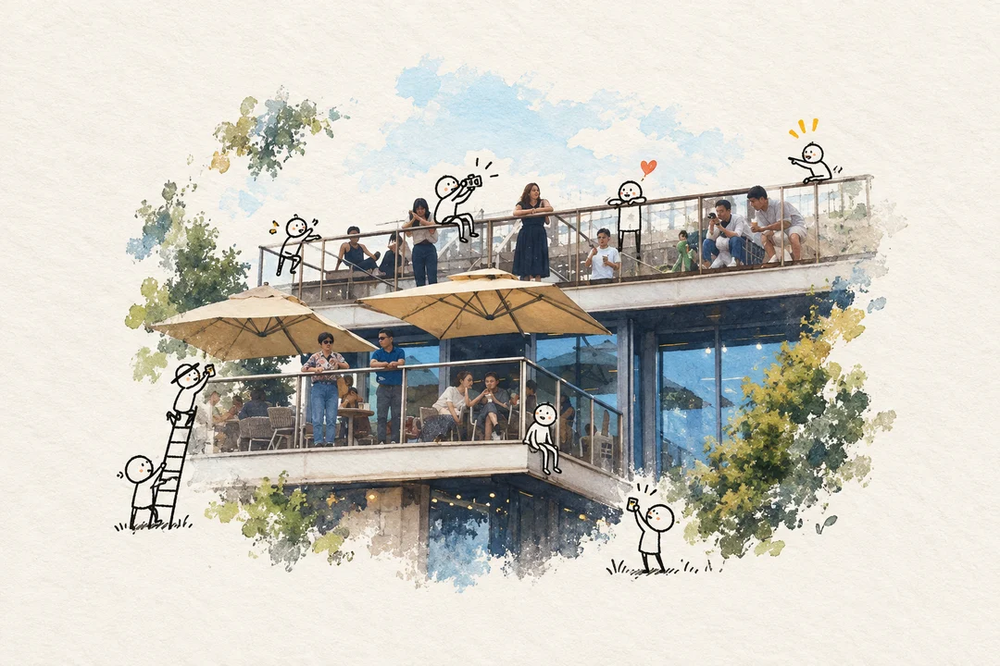
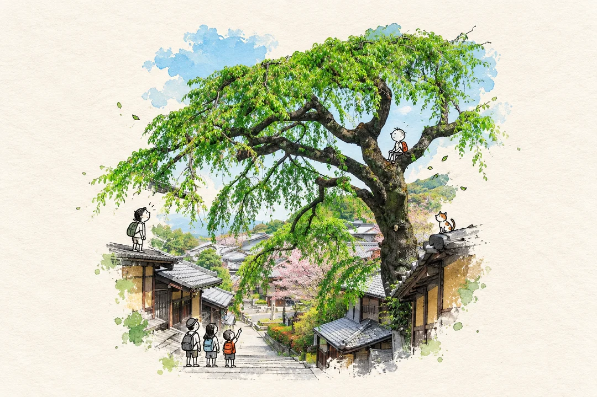

# 照片奇遇 · 照片与涂鸦创作

[← Albert 的影像手记](../../README.zh-CN.md) · [English](README.md) · [完整提示词](prompt.md)

**真实照片主体 · 黑线小人 · 微型幽默**

让照片里的人和物保持真实，再邀请几个手绘小人进来，发生一点小小的奇遇。


## 这一页的特色

主体保留摄影质感，只有参与故事的小角色是涂鸦。

**适合：** 人物、宠物、有动作的日常瞬间。

## 用自己的照片试试

安装一次 [Albert’s Imagebook](../../README.zh-CN.md#开始使用)，新开会话并上传照片：

```text
用 $albert-imagebook，把这张照片做成「照片奇遇」，不加字。
```

默认生成 1080×1440 的竖版纯作品。要复现本页的上下对照排版，可以说：

```text
用「照片奇遇」，原图在上、作品在下，各占一半，成品 1080×1440，不加字。
```

## 原图与作品



[查看原照片](../../assets/examples/source-beach-sunset.webp) · [查看单独作品](assets/beach-artwork.webp)

成品 1080×1440，上下各半；单独作品 1080×720。原照片铺满上半幅，靠左裁切保留三个人。
下方作品的纸底、笔触和自然散边一起生成，导出完整保留，没有额外白框或拼接白条。
没有新增文字。

## 更多照片，完整流程

咖啡露台与树下街巷使用完整风格提示词和共享交付规则生成，按作品区域最多 65% 的整体范围构图。
点击作品查看原图在上、作品在下的 1080×1440 对照图。

| 咖啡露台 | 树下街巷 |
| --- | --- |
| [](assets/coffee-terrace-65-comparison.webp) | [](assets/tree-street-65-comparison.webp) |

[咖啡原图](../../assets/examples/source-coffee-terrace.webp) · [街巷原图](../../assets/examples/source-tree-street.webp)

原图按中心裁切铺满半幅；街巷原图为竖版，宽幅对照会裁掉上下部分。
作品保留完整纸底与自然边缘。案例是实际生成结果，再次生成会有变化；
构图范围是视觉要求，不能理解为精确像素测量。

可以直接用中文名「照片奇遇」、英文名「Photo Play」或风格 ID `photo-doodle-story` 调用。

[阅读完整提示词](prompt.md) · [看看其他风格](../../README.zh-CN.md#风格手记)
